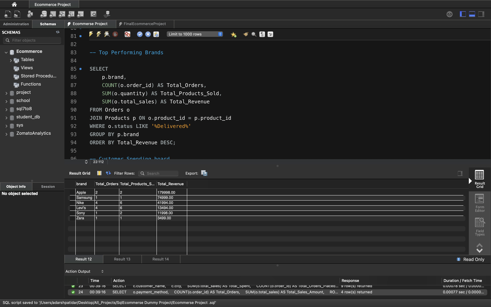
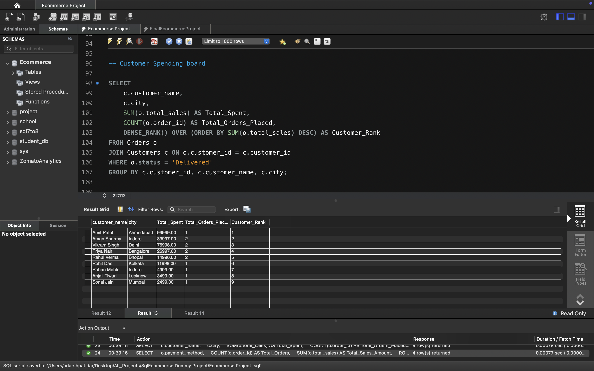
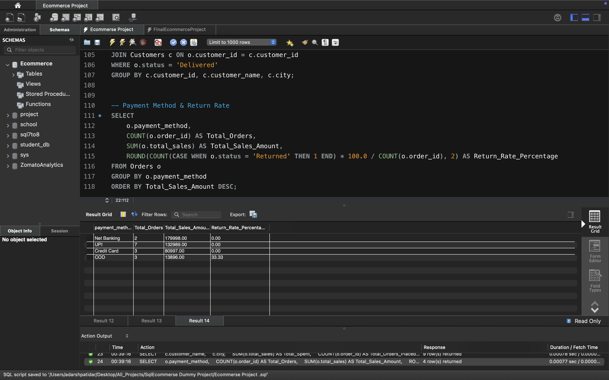

# E-Commerce Data Analysis & Business Intelligence (SQL)

A comprehensive relational database project designed to model and analyze e-commerce operations. This project showcases structured schema design, data integrity enforcement using Primary and Foreign Keys, and advanced analytical SQL queries (window functions, aggregations, and conditional formatting) to derive actionable business insights.

---

## 🛠️ Tech Stack & Tools
* **Database Management System:** MySQL
* **GUI Tool:** MySQL Workbench
* **Language:** SQL

---

## 📐 Database Schema & Architecture

The database is built on a relational star-like architecture with three optimized tables:
1. **Customers Table:** Tracks customer profiles and demographics (`customer_id`, `customer_name`, `city`, `state`).
2. **Products Table:** The core inventory catalog detailing catalog assets (`product_id`, `product_name`, `category`, `brand`, `price`).
3. **Orders Table:** The transactional operational hub that references parent records to track key performance metrics like revenue, volume, timelines, and logistics updates.

---

## 📊 Key Analytical Queries & Insights

Here are the primary advanced analytics reports extracted from the dataset:

### 1. Top Performing Brands
Lines up brands by the total revenue generated from delivered shipments.

```sql
SELECT 
    p.brand,
    COUNT(o.order_id) AS Total_Orders,
    SUM(o.quantity) AS Total_Products_Sold,
    SUM(o.total_sales) AS Total_Revenue
FROM Orders o
JOIN Products p ON o.product_id = p.product_id
WHERE o.status LIKE '%Delivered%'
GROUP BY p.brand
ORDER BY Total_Revenue DESC;


#### 📸 Query Output


---

### 2. Customer Spending Leaderboard
Ranks high-value customers by their total spend using the `DENSE_RANK()` window function.

sql
SELECT 
    c.customer_name,
    c.city,
    SUM(o.total_sales) AS Total_Spent,
    COUNT(o.order_id) AS Total_Orders_Placed,
    DENSE_RANK() OVER (ORDER BY SUM(o.total_sales) DESC) AS Customer_Rank
FROM Orders o
JOIN Customers c ON o.customer_id = c.customer_id
WHERE o.status = 'Delivered'
GROUP BY c.customer_id, c.customer_name, c.city;

#### 📸 Query Output


---

### 3. Payment Method & Return Rate Analysis
Tracks transaction volume across payment methods and calculates the return rate percentage using conditional logic.

```sql
SELECT 
    o.payment_method,
    COUNT(o.order_id) AS Total_Orders,
    SUM(o.total_sales) AS Total_Sales_Amount,
    ROUND(COUNT(CASE WHEN o.status = 'Returned' THEN 1 END) * 100.0 / COUNT(o.order_id), 2) AS Return_Rate_Percentage
FROM Orders o
GROUP BY o.payment_method
ORDER BY Total_Sales_Amount DESC;

#### 📸 Query Output


---

## 📌 Core Skills Demonstrated
* **Relational Database Design:** Enforced normalization standards using cascading relationships and Foreign Key constraints.
* **Window Functions:** Leveraged analytics features like `DENSE_RANK()` for accurate corporate reporting metrics.
* **Data Transformation:** Applied arithmetic filtering and conditional statements (`CASE WHEN`) to isolate conversion anomalies like customer returns.

